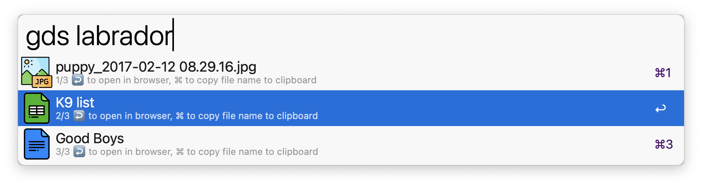

# alfred-gdriveSearch
 

Search text within your Google Drive files

<a href="https://github.com/giovannicoppola/alfred-gdriveSearch/releases/latest/">
 
</a>

## 🚀Usage
1. Launch `gdriveSearch` via keyword (default: `gds`) or hotkey, followed by your text search. Enter multiple words separated by space
2. `gdriveSearch` will return a list of matching documents
	1. Enter to open in your browser
	2. cmd-enter to copy the file name to clipboard
	
 

## Setting up ⚙️
*Note: this setup is more complex than the average workflow. I tried to document all the steps below, feel free to point to unclear steps or instructions. A screencast of the process is [here](https://github.com/giovannicoppola/alfred-gsheets/blob/main/images/googleAPIsetup.gif).*

### Setting up Google Drive API credentials (required):

1. Log into your Google account
1. Go to the [Google Developers Console](https://console.developers.google.com/)
1. Using the `Select a project` dropdown menu, create a new project (or select an existing one).
1. Click on `+ ENABLE APIS AND SERVICES` at the top of the page, then select  `Google Drive API` for your project. Click on `ENABLE`
1. From the API Console, click `Credentials` in the sidebar, then click on `+ CREATE CREDENTIALS` at the top of the page and select `Service account` to create a new service account key
1. enter an account name (e.g. "MyAlfredAPI") and a description (e.g. "for Alfred Workflow")
2. in `Manage service accounts`, select `Keys` and create a new JSON key, which will be downloaded onto your computer. This key contains your account credentials.
3. Move that file to your preferred location, then enter the path to the file in `Key File` in `Workflow configuration`. This is required for the workflow to work. 

1. Share the Google Drive documents (or folders) you want to search with the service account email address, granting it the appropriate access permissions. If a folder is shared, all documents within that folder will be searched (if the document type is checked in `Workflow configuration`). 

### Workflow Configuration
1. set the document types to be searched (default: all)
2. (optional) change the main keyword
2. (optional) set a hotkey

# Changelog
- 2024-09-16: first release (version 0.1)

# Thanks

- Icons from [Flaticon](www.flaticon.com) 
	- https://www.flaticon.com/free-icon/drive_324107
	- https://www.flaticon.com/free-icon/docs_324108
	- https://www.flaticon.com/free-icon/sheets_324127
	- https://www.flaticon.com/free-icon/file_16168674
	- https://www.flaticon.com/free-icon/excel_732220
	- https://www.flaticon.com/free-icon/unknown_9166568
	- https://www.flaticon.com/free-icon/word_732226
	- https://www.flaticon.com/free-icon/google_2991117
	- https://www.flaticon.com/free-icon/folder_15459340
	- https://www.flaticon.com/free-icon/jpg_2383417

# Feedback 🧐

Feedback welcome! If you notice a bug, or have ideas for new features, please feel free to get in touch either here, or on the [Alfred](https://www.alfredforum.com) forum. 

